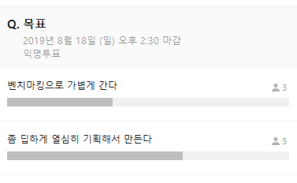

# 20190818 2번째 모임

Created By: 똘비 
Last Edited Time: Sep 01, 2019 1:36 PM
Meeting Date: Aug 18, 2019
Participants: Dayoung Jeong,Deleted User,HYEONSU KWON,Mini Yoon,NaHyeon Kim,Youha Bak,똘비 ,태은 김
Subject: 프로젝트 구체화

디자이너 🍞님  처음 참석하셨습니다.

초기안은 모바일 웹을 기준으로 진행.

다음 모임부터 지각비 걷기로(10분 당 천원)

# ✔지난 모임 숙제

- [ ]  프로젝트를 위한 개인적인 학습 진행 정도 공유
- [x]  프로젝트 구체화 ( 모임 앞 2시간 정도 진행)
- [x]  GUI 능한 디자이너 한분 더 모시기

# 미니 워크샵

> 프로젝트 빌드 규모 논의

투표 진행 결과 ~~

딥하게 기획 단계 부터 진행👏👏👏👏

어난:  기존 스터디들 목적이 혼자하기 힘듦에 취지를 둠. ⇒ 한국형 학습형태에 최적화 됨

- 서비스의 경쟁사들은 → 기존의 커뮤니티 게시판 형식을 그대로 플랫폼으로 옮겨옴(텍스트 위주)
- 공부에 집중할 수 있는 스터디 서비스가 없음
- 스터디 당 장르별 특화된 부분이 있음 (ex) 개발 → 소스코드 컨펌
- 여러 툴에 흩어져 있는 스터디에 필요한 서비스를 하나에서 체크할 수 있었으면 좋겠음
- 기존에 큰 카테고리에 맞춰져 있는 스터디 태그( 자격증, 개발, 어학) ,  장르 특성화된 스터디 플랫폼이 경쟁력이 있지 않을까 고려

보노 : 서칭 기능을 딥하게 들어갈 수록 너무 많이 나옴,

- 스터디 난이도나 조원들의 수준? 을 파악할 수 있음 좋겠음

닉 : 장르 특성화가 되어있으면 좋겠다는 의견이 좋았음. 자기 분야 외에 스터디가 어떻게 진행되어있는지 모름. 

우주: 기획 시 가장 중점으로 둔 점 → 로깅, 공유가 가장 큰 목적.  장르 특성화

- 이제  막 시작한, 로깅이 어려울 수 있음.  장르에 대한 템플릿을 제공해주면 사용자가 쉽게 접근할 수 있을것.

보노 : 목표 달성을 하면 공유할 수 있었으면 좋겠음

- ex) 인스타그램에 공유할 수 있는 이미지 생성

우주 : 우리가 잘 아는분야부터 시작하는게 좋은 것 같음. 추 후 분야 확장. 

- 일단 개발스터디 플랫폼

어난 : 디자이너 스터디 , UX 스터디나 개발자들과 함께 하는 경우가 많았음

빵 : 스터디를 모으는 것은 지인끼리 많이 진행했던 것 같음. 

  

## 기능 세부화

닉:  개발 시작 시 언어부터 시작함. 

똘비 : 카테고리를 스터디를 명시하는 해쉬태그로 했음 좋겠음

예감 : **스터디 기간을 명시**해 두면 더 좋을 것 같음

- ex) **30, 60 일~**

닉 :  유저들이 짧은 기간을 많이  선호할 것 같음

목표 설정, 

닉: 스터디 기한이 자나도 **연장**할 수 있는 기능이 있음 좋겠음.  동의 안 하는 사람은 모임 내보내기

어난: 각자 스터디를 해야겠다 생각이 드는 타이밍은?

- 주변에서 하자고 해서
- 공모전을 제출 목적 스터디, 친구들끼리 개발하자 시작
- 학교에서 어려운 과목에 대한 스터디
- 협업, 돈에 의한 목적

⇒ 혼자 공부하기 힘든 상황, 주변에서 공부할 환경 형성, 주변에서 총대매고 강제 참여

- 주로 총대매는 사람이 모임개설 or  주변 사람들을 모임에 참여시키거나
- 초기 주 사용자는 총대매는 사람일 것 같음.
- 검색엔진에 모임, 스터디가 노출 되어야 함. ⇒ SEO
- 공유가 용이

서버 비용에 대한 고려

- 한 스터디 당 업로드 용량이 정해져 있음 좋겠음

닉: 노션은 15$를 지원하고 개인의 자유도를 둠

어난: 노션은 기존 에버노트에 비해 트리구조 wiki처럼 사용할 수 있어 좋음

닉: 노션이 정말 좋다고 생각한게 , import, export 기능이 좋은 것 같음

각자 스터디를 어떻게 진행하느냐? 

보통 개발 스터디는 책으로 시작하는 경우가 많다. 책의 목차 따라 진행

알고리즘 스터디 경우 문제를 어디까지 풀자 하는

개발목적으로 스터디 하는거니 로깅시에 웹페이지에서 코드 실행할 수 있는 기능

(jsfiddle, codepen같음)이 있으면 좋겠음

닉: 전에 스터디 했을 때, 환경 설정이 복잡한 경우가 있었는데 , 설정하는 부분을 영상공유 했음.

스터디 시 영상공유 할 수 있는 기능이 있음 좋겠음

출석률은 총대가 하고, 참여도는 로깅량을 따라  측정되지 않을까

서로 크로스 체킹을 할 수 있음 좋을 것 같음**. 회고 , 피드백**

- 스터디 마다 다르게 닉네임을 정했으면 좋겠음

패널티 기능이 있었으면 좋겠음.  

스커디 모집 시 해당 모임이 추구하는 바를 적었으면 좋겠음

- 팀원 조건 제한 ( 성별, 나이, 지역 등등)

## 🖌디자인 일정

- 와이어 프레임 나오기까지 한 달 정도 진행
    - 그 일정동안 개발자들은 개발 스터디를 진행
- 와이어프레임이 나오면 세부화면에 대한 디자인을 진행 후 프론트는 바로 진행가능한 화면 부터 진행

## 💻개발 일정

프로젝트 생성은 스터디를 조금 진행해보고 하는게 좋을 것 같음

- 백엔드 : express, mongo , moongose 학습 (라우터까지)
- 프론트 : react, react-hooks, redux, 컴포넌트 단위, life cycle, sass/css

일주일에 한번 스터디 일정 공유