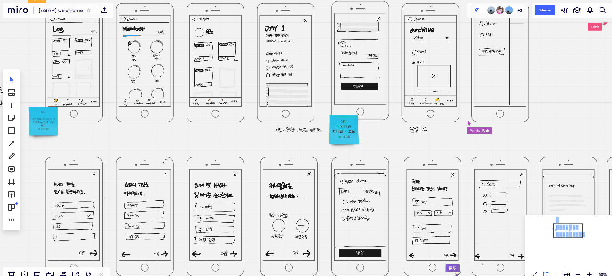

# 20190901 3번째 모임

Created By: 똘비 
Last Edited Time: Sep 29, 2019 10:02 AM
Meeting Date: Sep 01, 2019
Participants: Dayoung Jeong,HYEONSU KWON,Youha Bak,똘비 ,태은 김
Subject: 와이어 프레임, 개발자 근황 토크

# 🎇어난님의 와이어 프레임🎇

[https://miro.com/app/board/o9J_kwmiLz8=/](https://miro.com/app/board/o9J_kwmiLz8=/)

슬랙같은 서비스처럼 워크스페이스 전환 가능

### Log

사용자가 참여하고 있는 스터디의 로깅 목록이 보여짐

### Log 상세

편집화면

- 상세화면에 있는 체크리스트가 Member 화면 이미지 원형 프로그레스 바로 보여줌 (개인 달성률)
- 전체 달성률은 로그 화면 / Member 화면에 노출 시킬지는 고려

### archive

스터디별로 컨텐츠만 볼 수 있는 화면

상단에는 필터기능( 동영상, 이미지, ...)

- 여러사람 코드를 모아보기

### Member

스터디별로 구성원들을 볼 수 있음 ( 스터디의 역할)

### study 등록

언어, 기간, 인원, 커리큘럼 을 설정할 수 있음

커리큘럼

- 추천 커리큘럼 : 생활 코딩이나 유명 커리큘럼
    - 상세(팝업)을 보고싶으면 썸네일 클릭
    - 상세는 체크리스트 정도
- 직접 구성

 의견

- 영리적 목적으로 크롤링을 할시에 문제가 될 수 있음
- 다른 사람이 했던 커리큘럼(공개/ 비 공개) 를 추천하는게 어떤지

# 🙇‍♀️개발자 고해성사 시간🙇‍♀️

## 우주

평가일정이 꽉차있어 로깅에 todolist를 수행하지 못 했음

학교에서 하는 프로젝트를 nodejs를 활용해서 웹소켓을 활용한 채팅을 구현함

프로젝트를 수행하면서 문법이나 nodejs에 대한 이해도가 높아짐

현재 기존에 한 php코드를 nodejs로 바꾸는 작업을 하고 있음

## 닉

회사에서 API서버를 다시 만들고 있음. 

node로 통해 작업중이고, 다른 문서를 보니 mongodb 를  많이 사용하길래  문서를 많이 봤음

현재 복싱을 하고 있음

## 보노

알바를 오전알바라 시간적 여유가없었음

html, css 학습을 생활코딩을 통해 학습하려 했으나 시간 부족

html 학습완료 ,css 50%정도 학습

학습 로깅을 다음주로 미룸

## 둔두

생활코딩에서 nodejs 강의를 계속 보고있음

현재 js부분임. 다행이 js에 대한 개념이 있어서 수월하게 넘어갈 수 있음

nodejs, mongodb세팅을 해놨음

## 똘비

hooks 밸로퍼트 블로그 보면서 실습

# 그 외 활동(?)🚶‍♂️

github organization 생성

이 이외에 각자 개인적인 학습 & 잡담을 했습니다 

# ✔TO-DO LIST(~29일)

- [ ]  어난 : 와이어프레임 완성, 대략적인 그래픽디자인 스케줄링
- [ ]  개발자 환경 설정 (프로젝트 생성)
    - [ ]  닉 : 백엔드 프로젝트 생성 (node, mongo)
    - [ ]  똘비: 프론트엔드 프로젝트 생성  (react, react hooks, react route, sass)
- [ ]  프로젝트 이름 확정하기
- [ ]  개발 스터디로깅 매주 작성