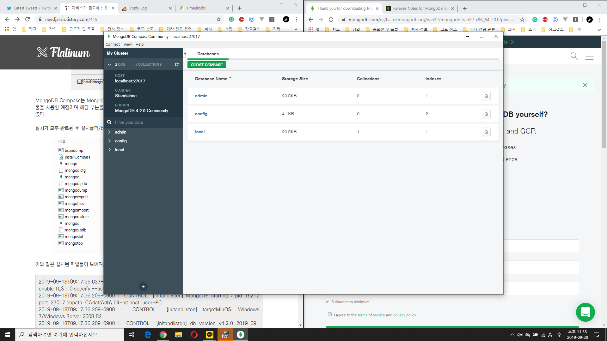

# #UJU

Created: Aug 26, 2019 11:18 PM
Subject: 개인로깅

# 8월 26일

로깅을 좀 꾸준히 해야하는데 항상 미루고 미루다가 결국 안하게 되더라고요... 그래도 이렇게 다같이 로깅을 할 수 있게 되어서 좋습니다 :) 다음 주는 평가 계획이 가득 잡혀있어서 부득이하게 강의 듣기로만 계획을 잡아두었습니다. 평가가 끝나는대로 다시 열심히 달릴 예정이에요 🏃‍♀️🏃‍♀️

현재 Node.js 코드를 분석하며 과제 겸으로 하고 있는 프로젝트는 Socket.io를 이용한 채팅 프로그램입니다. 완성된 코드를 보며 문법과 사용법을 분석하는 것이 처음부터 짚어나가는 것보다 빠르게 습득할 수 있을 것 같아 시도해보고 있습니다. 나름 괜찮은 것 같아요. @태은 김 님께서 갠톡으로 많은 도움을 주셨습니다! ❤ 

참고하고 있는 코드 블로그 강의 : 

[[Node.js] 실시간 채팅 서비스 만들기(1) - 준비](https://codevkr.tistory.com/58?category=719250)

코드를 분석하며 수정 중인 프로젝트를 올리는 제 깃허브 주소 : 

[helloworld-hellohyeon/node-chatting-template](https://github.com/helloworld-hellohyeon/node-chatting-template)

그리고 Node.js + express.js + ejs 템플릿으로 프로젝트 생성하는 방법이 올라온 블로그 : 

[그저 그런 블로그](https://samuel-alter1128.tistory.com/m/13)

ejs 템플릿을 이용하면 라우터와 view를 분리하여 구성하는데 Spring MVC 패턴이랑 비슷하더라고요! 익숙해지니 굉장히 편합니다 :) 과제 제출이 8월 29일이라 그날까지 이 프로젝트는 완성될 계획이에요. 완성 되어야하는데 말이에요....... 다음주까지 강의를 들으며 간단한 예제를 따라하고 그 다음주부터는 만들어보았던 간단한 웹들을 Node.js로 바꾸며 mongoDB를 연동하는 방법을 공부할 계획입니다! 모두 힘내세요! o((>ω< ))o

---

# 9월 1일~29일

~~한 것이 너무 없어서 한 달치를 몰아서 씁니다 ㅠㅠ...~~

9월 내내 학교 과제로 바빠 따로 React 강의를 듣지는 못하였습니다. MongoDB 설치와 세팅을 완료하였습니다.

**10월에 할 일**

- [ ]  ***꼭  React 강의 들으면서 만들어뒀던 간단한 프로젝트 React로 변경해보기***
- [ ]  졸업고사 잘 보기...