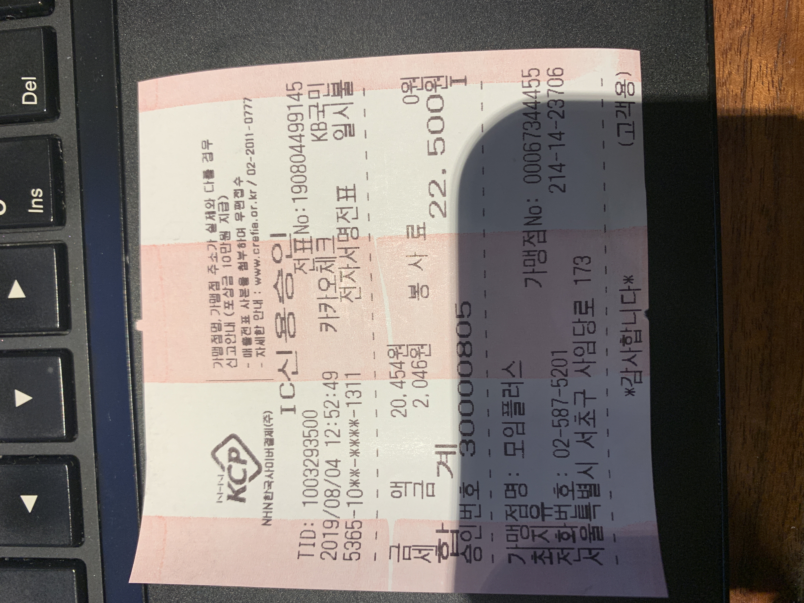
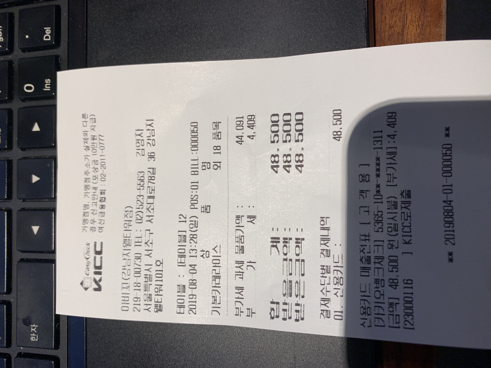

# 8/4 ASAP 모임 공금 사용 내역

Created: Aug 04, 2019 11:21 AM
Created By: 태은 김
Last Edited Time: Oct 09, 2019 12:21 PM
Type: 공금

# 참석자 명단

- 둔두
- 닉
- 보노
- 똘비
- 어난
- 예감

# 오늘 예산

총 6만원 사용 가능

스터디룸 비용 : 인당 4,500(총 22,500원, 예감님 미포함)

식당 비용 :  총 48,500원

총 사용 비용은 71,000원

초과 ㅜㅜ 다음 모임때 사용할 수 있는 비용은 49,000 원입니다.

# 스터디카페

[https://www.google.co.kr/maps/place/%EB%AA%A8%EC%9E%84%ED%94%8C%EB%9F%AC%EC%8A%A4/@37.4927616,127.0263695,17z/data=!3m1!4b1!4m5!3m4!1s0x357ca15ab2f4655f:0x1cd4959d5a5ec5e8!8m2!3d37.4927616!4d127.0285582?hl=ko](https://www.google.co.kr/maps/place/%EB%AA%A8%EC%9E%84%ED%94%8C%EB%9F%AC%EC%8A%A4/@37.4927616,127.0263695,17z/data=!3m1!4b1!4m5!3m4!1s0x357ca15ab2f4655f:0x1cd4959d5a5ec5e8!8m2!3d37.4927616!4d127.0285582?hl=ko)

# 식당

[https://www.google.com/maps/place/%EC%95%84%EB%B9%84%EA%BC%AC%EC%B9%B4%EB%A0%88/@37.4953884,127.0275407,17.91z/data=!4m8!1m2!2m1!1z7JWE67mE6rys!3m4!1s0x0:0xde51e18684bbfd76!8m2!3d37.4944221!4d127.0282073?hl=ko](https://www.google.com/maps/place/%EC%95%84%EB%B9%84%EA%BC%AC%EC%B9%B4%EB%A0%88/@37.4953884,127.0275407,17.91z/data=!4m8!1m2!2m1!1z7JWE67mE6rys!3m4!1s0x0:0xde51e18684bbfd76!8m2!3d37.4944221!4d127.0282073?hl=ko)